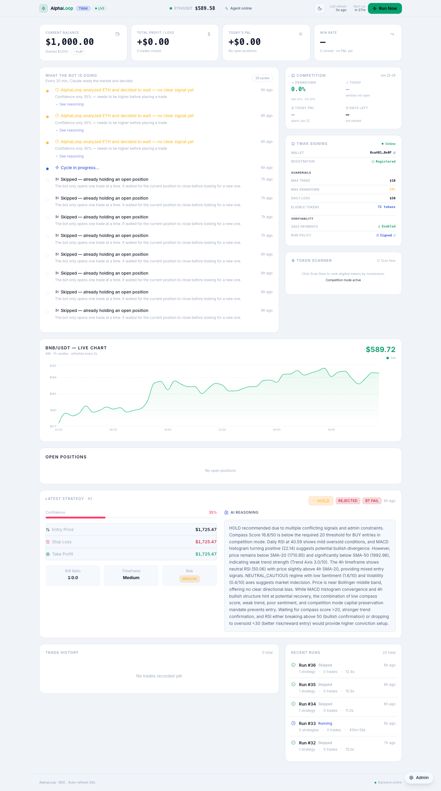

# AlphaLoop

> Autonomous AI trading agent for BSC — built for the **BNB HACK × CoinMarketCap × Trust Wallet $36,000 hackathon**.

[](https://dorahacks.io/hackathon/bnbhack-twt-cmc)
[](https://bscscan.com)
[](https://anthropic.com)
[](https://trustwallet.com)
[]()

AlphaLoop uses Claude AI to generate, backtest, and autonomously execute crypto trading strategies on BSC mainnet via TWAK (Trust Wallet Agent Kit). Every trade is governed by a **5-Axis Market Compass** and committed on-chain as a verifiable proof before execution.

---



---

## Live Deployment

| Service | URL |
|---|---|
| Dashboard | http://p9afyi7epwshbwbqgon9qa2f.75.119.139.99.sslip.io |
| Agent API | http://qp38fy65jtmff7agx1e4ufr0.75.119.139.99.sslip.io |
| API Docs | http://qp38fy65jtmff7agx1e4ufr0.75.119.139.99.sslip.io/docs |

**Competition wallet:** `0xa401A91faa968Ee4334780712C95Af208E570e0F`  
**Trading window:** June 22–28, 2026 UTC  
**Registration TX:** `0x2f11419f8aea72604975a5e0101f2a79fd6d0ac42fd427a03cba887e07e53b0b`

---

## What the Agent Does Every 30 Minutes

1. **Scans eligible tokens** — momentum scorer with hysteresis (avoids constant switching)
2. **Computes 5-Axis Market Compass** — Trend / Momentum / Sentiment / Volatility / Stress (0–50 score)
3. **Generates strategy via Claude** — full compass state sent in prompt, Claude reasons about regime
4. **Checks Edge Gate** — `confidence × (momentum / 10) − 0.8% > 0` — skips low-value trades
5. **Runs walk-forward backtest** — 45-day in-sample + 15-day out-of-sample, rejects if it fails
6. **Executes swap via TWAK** — position sized by compass regime × drawdown zone multiplier
7. **Commits proof to BSC** — SHA-256 of decision stored as calldata before trade executes

---

## 5-Axis Market Compass

AlphaLoop's core regime detection engine. Each axis scores 0–10 independently:

| Axis | Inputs | Source |
|---|---|---|
| Trend | EMA9/21 cross + price vs SMA20/50 | Binance OHLCV |
| Momentum | RSI + MACD histogram + 24h change | Binance OHLCV + CMC |
| Sentiment | Fear & Greed index + BTC dominance | alternative.me + CMC |
| Volatility | ATR percentile + BB-width percentile (moderate = best) | Binance OHLCV |
| Stress | Perp funding rate z-score + price stretch from SMA50 (inverted) | Binance FAPI |

**Compass Score = sum of 5 axes (0–50)**

| Score | Regime | Position Size |
|---|---|---|
| 35–50 | MOMENTUM_RIDE | 100% |
| 25–35 | TREND_CONFIRM | 85% |
| 15–25 | NEUTRAL_CAUTIOUS | 60% |
| 8–15 | DEFENSIVE | 30% |
| < 8 | RISK_OFF | Skip trade |

---

## Safety System (Drawdown Cascade)

| Zone | Drawdown | Position Size | Extra Gate |
|---|---|---|---|
| GREEN | < 8% | 100% | — |
| YELLOW | 8–15% | 70% | — |
| ORANGE | 15–22% | 40% | Compass score ≥ 15 |
| RED | 22–25% | 10% | Compass score ≥ 35 |
| HALT | ≥ 25% | 0% | No new trades (DQ at 30%) |

Additional guards every cycle:
- **Daily loss cap** — pause if loss > $50/day
- **Stale position force-close** — auto-close if open > 20h
- **Smart compliance window** — soft 18h UTC, alert 22h, hard close 23h
- **Position guard** — max 1 open trade at a time
- **Max trade size** — $10 per position

---

## On-Chain Decision Proof

Every executed trade produces a verifiable proof committed to BSC before the swap:

```
ALPHALOOP_PROOF_v1|{timestamp}|{symbol}|{compass_score}|{axes}|{confidence}|{action}|{entry_price}
```

SHA-256 of this string is stored as calldata in a self-transfer BNB transaction. Anyone can verify:

```bash
python scripts/verify_trade.py --trade-id 42 --check-chain
```

---

## Architecture

```
APScheduler (every 30 min)
       │
       ▼
TokenScanner ──▶ hysteresis-ranked BEP-20 tokens (149 configured, ~30 active on Binance)
       │
       ▼
CMC Client ──▶ quote + OHLCV + global metrics (btc_dominance, F&G)
       │
       ▼
Indicators ──▶ RSI, MACD, BB, SMA20/50, EMA9/21, ATR
       │
       ▼
5-Axis Market Compass ──▶ Trend / Momentum / Sentiment / Volatility / Stress
       │                   score 0–50 → regime profile → position sizing
       ▼
Claude AI ──▶ BUY / SELL / HOLD + confidence + entry / SL / TP + reasoning
       │       (receives full compass state in prompt)
       │
       ├── HOLD or low confidence → skip
       ├── Edge Gate: conf × momentum − cost ≤ 0 → skip
       │
       ▼
Backtester ──▶ walk-forward IS/OOS → fail → skip
       │
       ▼
Build Proof ──▶ sha256(compass_state + decision) = proof_hash
       │
       ▼
TWAKExecutor ──▶ POST /actions/swap → BSC mainnet
       │
       ▼
Commit Proof ──▶ self-transfer BNB tx with proof_hash as calldata
       │
       ▼
SQLite ──▶ trade + strategy + proof_string + proof_hash + run saved
```

---

## Stack

| Layer | Library | Purpose |
|---|---|---|
| API server | FastAPI + uvicorn | REST endpoints, lifespan hooks |
| Scheduler | APScheduler | 30-min trading cycle + 2-min position monitor |
| Regime engine | custom (data/regime.py) | 5-Axis Market Compass |
| Market data | httpx + CMC API | Quotes, OHLCV, global metrics |
| Token scanner | Binance public API | Hysteresis-aware momentum ranking |
| Strategy | Anthropic Claude (claude-sonnet-4-6) | LLM reasoning with full compass context |
| Indicators | pandas + numpy | RSI, MACD, BB, SMA, EMA, ATR |
| Backtesting | Pure Python | Walk-forward IS/OOS validation |
| Execution | TWAK REST API | Self-custody swap via Trust Wallet Agent Kit |
| Database | SQLAlchemy 2.0 + aiosqlite | Async SQLite ORM |
| Dashboard | Next.js 14 | Live chart, compass bar, drawdown zone, equity curve |
| Infrastructure | Coolify + Docker on VPS | Auto-deploy, 3-container stack |

---

## API Endpoints

| Method | Path | Description |
|---|---|---|
| GET | `/health` | Liveness check + live BNB price |
| GET | `/status` | Last run, compass score, open positions |
| GET | `/trades` | All executed trades |
| GET | `/strategies` | All generated strategies |
| GET | `/runs` | Agent run history |
| GET | `/activity` | Plain-English cycle summaries |
| POST | `/run` | Trigger one cycle manually |
| POST | `/monitor` | Check TP/SL on open positions |
| GET | `/competition/status` | Drawdown zone, daily trades, stale positions |
| POST | `/competition/register` | On-chain competition registration |
| POST | `/competition/scan` | Token scanner results now |
| GET | `/twak/status` | TWAK wallet, balance, registration |
| GET | `/admin/config` | Runtime config |
| POST | `/admin/config` | Update config (pause, position size, etc.) |
| POST | `/admin/close-all` | Emergency close all positions |

---

## Project Layout

```
alphaloop/
├── agent/
│   ├── config.py              — env-var config singleton
│   ├── main.py                — FastAPI app + all endpoints
│   ├── scheduler.py           — run_agent_cycle() + APScheduler
│   ├── competition.py         — drawdown cascade, stale close, compliance window
│   └── proof.py               — on-chain decision proof builder
│
├── data/
│   ├── cmc_client.py          — CMC Pro API client (quotes, OHLCV, global metrics)
│   ├── indicators.py          — RSI, MACD, BB, SMA, EMA, ATR
│   ├── token_scanner.py       — hysteresis-aware momentum token ranking
│   └── regime.py              — 5-Axis Market Compass engine
│
├── strategy/
│   ├── generator.py           — Claude strategy generation with compass context
│   └── backtester.py          — walk-forward IS/OOS backtester
│
├── execution/
│   ├── twak_executor.py       — TWAK REST swap executor (primary)
│   ├── pancakeswap.py         — PancakeSwap V2 (fallback)
│   └── wallet.py              — web3.py wallet helper
│
├── db/
│   └── models.py              — SQLAlchemy ORM (Trade, Strategy, Run, proof columns)
│
├── dashboard/                 — Next.js 14 live dashboard
│   └── components/
│       └── CompetitionPanel.tsx — drawdown zone badge + compass bar
│
├── scripts/
│   ├── start_competition.sh   — one-command local launch
│   ├── stop.sh                — stop all local processes
│   ├── twak-entrypoint.sh     — Docker entrypoint (auto-creates wallet on first boot)
│   ├── verify_trade.py        — verify on-chain proof for any trade
│   └── check_ready.py         — pre-competition readiness checker
│
└── docs/
    └── dashboard.png          — live dashboard screenshot
```

---

## Local Development

```bash
# 1. Copy env template and fill in keys
cp .env.example .env

# 2. Start TWAK (keep this terminal open)
twak serve

# 3. Start agent + dashboard
bash scripts/start_competition.sh

# 4. Stop everything
bash scripts/stop.sh
```

| Service | Local URL |
|---|---|
| Dashboard | http://localhost:3001 |
| Agent API | http://localhost:8000 |
| API Docs | http://localhost:8000/docs |

---

## Environment Variables

| Variable | Default | Description |
|---|---|---|
| `ENVIRONMENT` | `testnet` | Set to `mainnet` for live trading |
| `DRY_RUN` | `true` | Set to `false` to execute real trades |
| `COMPETITION_MODE` | `false` | Set to `true` to enable all guardrails |
| `CMC_API_KEY` | — | CoinMarketCap Pro API key |
| `ANTHROPIC_API_KEY` | — | Anthropic Claude API key |
| `AGENT_PRIVATE_KEY` | — | BSC wallet private key (fallback only) |
| `BSC_RPC_URL` | testnet RPC | `https://bsc-dataseed.binance.org/` for mainnet |
| `TWAK_REST_URL` | — | TWAK server URL |
| `TWAK_ACCESS_ID` | — | TWAK access ID |
| `TWAK_HMAC_SECRET` | — | TWAK HMAC secret |
| `TWAK_WALLET_NAME` | `alphaloop` | TWAK wallet name |
| `TWAK_WALLET_PASSWORD` | — | TWAK wallet unlock password |
| `MAX_POSITION_SIZE_USD` | `10` | Max USD per trade |
| `INITIAL_PORTFOLIO_USD` | `1000` | Starting portfolio value (for drawdown calc) |
| `DATABASE_URL` | `sqlite+aiosqlite:///./storage/alphaloop.db` | DB path |
| `HYSTERESIS_MARGIN` | `0.15` | Token scanner displacement threshold |
| `ROUND_TRIP_COST_PCT` | `0.008` | Edge gate round-trip cost estimate (0.8%) |
